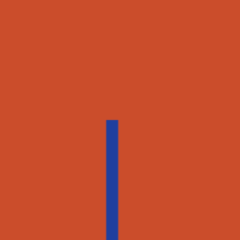
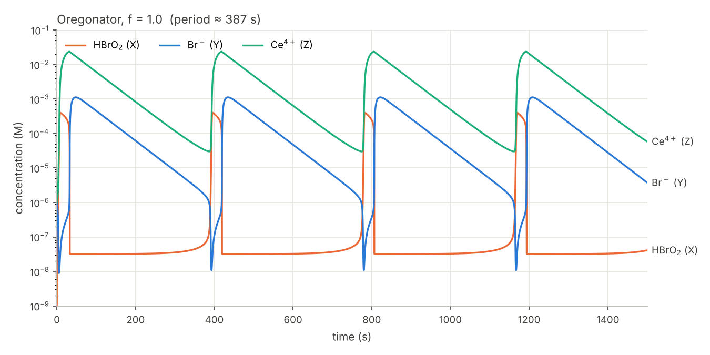
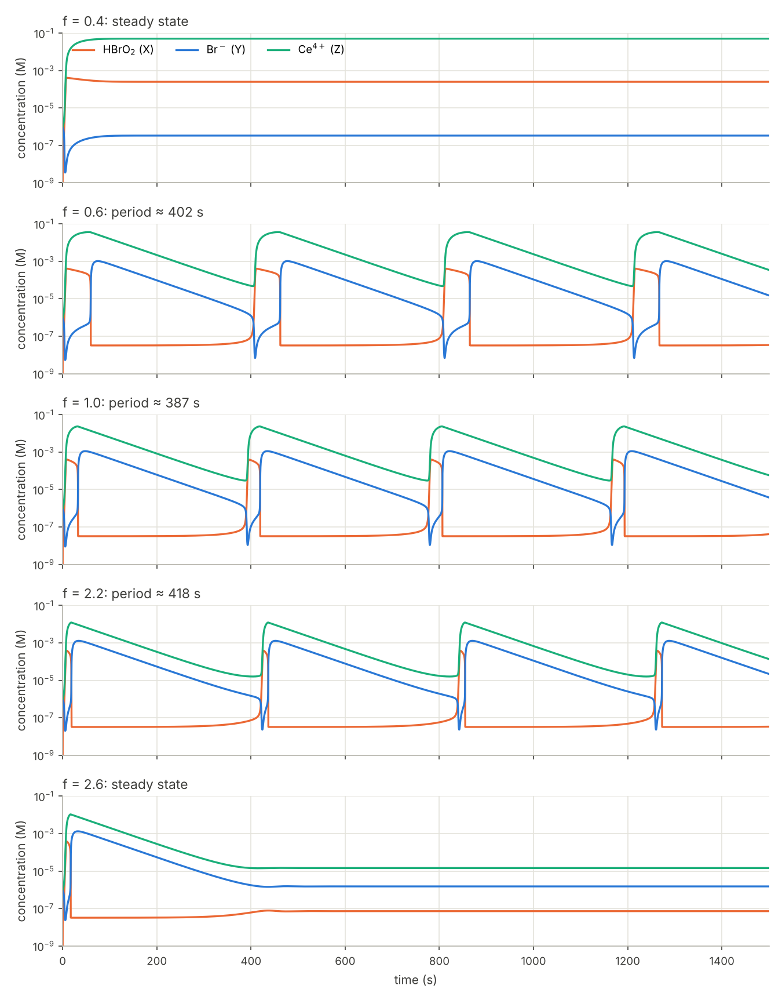
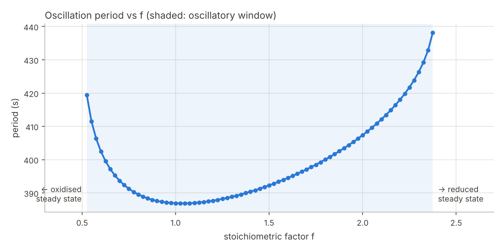
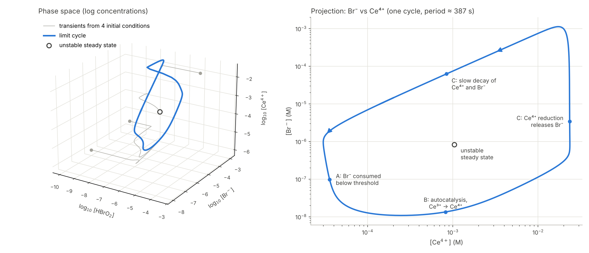
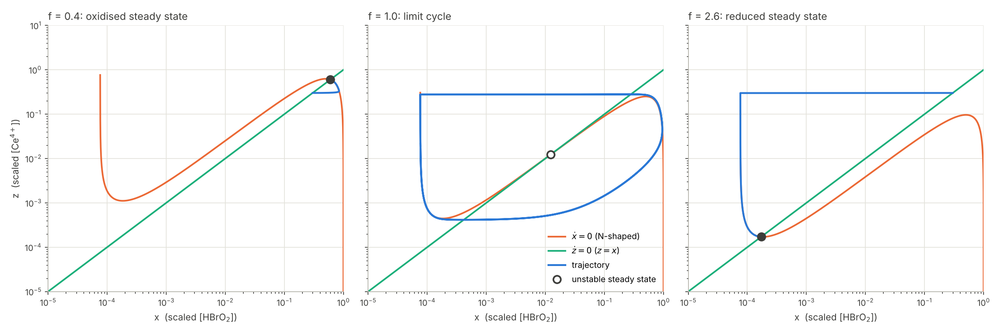
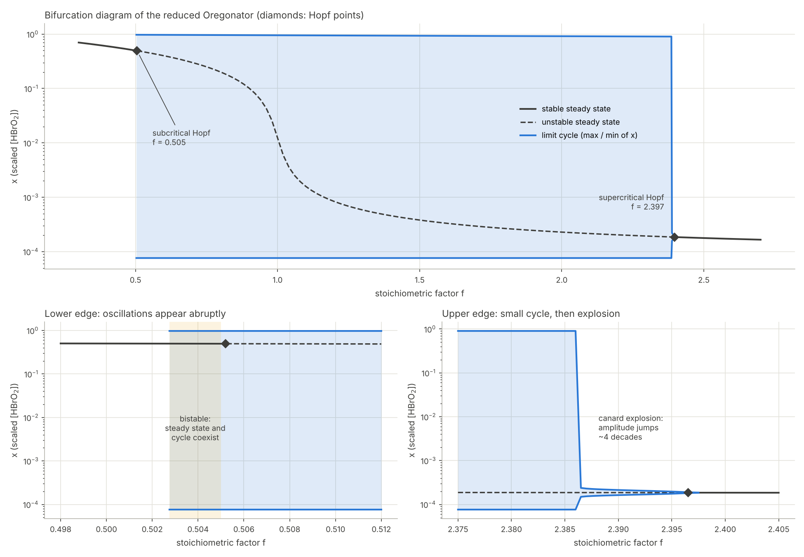
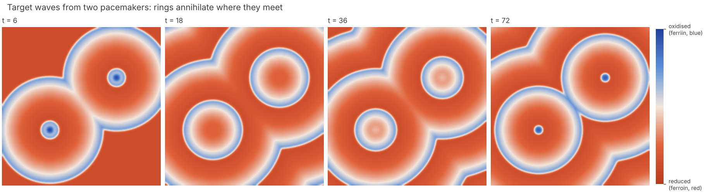
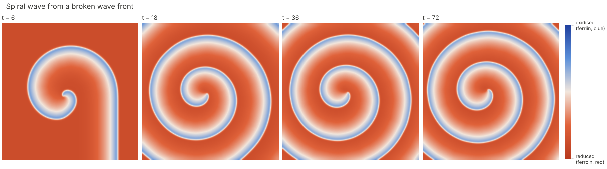

# Belousov–Zhabotinsky Reaction Modeling

Numerical simulation of the **Belousov–Zhabotinsky (BZ) reaction**, the classic
oscillating chemical reaction, using the **Oregonator** kinetic model.

<p align="center">
  
  
</p>
<p align="center"><sub>Simulated spiral and target waves in an excitable BZ medium (one-minute loops).</sub></p>



## Background

In the BZ reaction, bromate oxidizes an organic substrate (malonic acid) in acid,
catalysed by a redox couple (Ce³⁺/Ce⁴⁺ or ferroin/ferriin). Instead of relaxing
monotonically to equilibrium, the intermediates oscillate for tens of minutes
(visible as red ↔ blue colour switching with ferroin).

The **Oregonator** (Field & Noyes, 1974) reduces the full FKN mechanism to five
steps and three intermediates:

| Step | Reaction | Rate |
|------|----------|------|
| O1 | A + Y → X + P | k₁·A·Y |
| O2 | X + Y → 2P | k₂·X·Y |
| O3 | A + X → 2X + 2Z | k₃·A·X |
| O4 | 2X → A + P | k₄·X² |
| O5 | B + Z → ½f·Y | k_c·B·Z |

A = BrO₃⁻, B = malonic acid, **X = HBrO₂** (activator), **Y = Br⁻** (inhibitor),
**Z = Ce⁴⁺** (oxidised catalyst). A and B are held constant.

Rate equations (mass-action kinetics):

```
dx/dt = k1·A·y − k2·x·y + k3·A·x − 2·k4·x²
dy/dt = −k1·A·y − k2·x·y + ½·f·kc·B·z
dz/dt = 2·k3·A·x − kc·B·z
```

**How it oscillates:** autocatalytic growth of HBrO₂ (O3) is suppressed while
Br⁻ is high. Once Br⁻ falls below a threshold, HBrO₂ explodes and oxidises the
catalyst (Z). Z then slowly regenerates Br⁻ (O5), shutting autocatalysis off
again. The delay introduced by Z is essential: eliminating it removes the
oscillations.

Conventions follow Field & Noyes (1974): step O3 is the net of
BrO₃⁻ + HBrO₂ → 2BrO₂• and 2BrO₂• + 2Ce³⁺ → 2HBrO₂ + 2Ce⁴⁺, so bromate is the
reactant and two Ce⁴⁺ are formed per event.

### Oscillation period

With the default Field–Noyes parameters (f = 1) the period is ≈ 390 s. The
period is set mainly by the slow catalyst-reduction step O5: after each spike,
Ce⁴⁺ must decay with rate constant k_c·B before Br⁻ falls low enough to let
autocatalysis restart, giving period ≈ 8 / (k_c·B). k_c is a lumped, empirical
constant, so the absolute period is a tunable quantity; experimental periods
(tens of seconds to minutes) depend on [BrO₃⁻], [malonic acid], [H⁺] and the
catalyst.

### The stoichiometric factor f

f is the number of Br⁻ ions returned per two Ce⁴⁺ reduced in O5. It lumps the
complex organic chemistry of Process C into one number and sets the **strength
of the negative feedback**:

- **f < ≈ 0.5**: too little Br⁻ is regenerated to switch autocatalysis off. The
  system sits in an **oxidised steady state** (high HBrO₂ and Ce⁴⁺, low Br⁻).
- **≈ 0.5 < f < ≈ 2.4**: oscillations. The theoretical limit is
  0.5 < f < 1 + √2 as k_c → 0. The period is shortest near f ≈ 1 and grows
  toward both edges.
- **f > ≈ 2.4**: Br⁻ is regenerated so strongly that autocatalysis never
  restarts. The system sits in a **reduced steady state** (low HBrO₂ and Ce⁴⁺, Br⁻ held above the switching threshold).

Both edges are Hopf bifurcations.





### Phase portrait: the limit cycle



In (x, y, z) phase space the oscillation is a closed orbit, a **limit cycle**.
Trajectories started from very different concentrations (grey), including a
tiny kick away from the steady state, all converge onto the same orbit. It is an
**attractor**: amplitude and period are fixed by the chemistry, not by the
initial conditions. This is the key difference from the Lotka–Volterra model,
whose closed orbits are conservative centres that shift with every perturbation.

The steady state at the centre is **unstable**. Its Jacobian eigenvalues at
f = 1 are λ ≈ −14.2, +1.69 and +5.1·10⁻⁴ s⁻¹; the two positive values push
trajectories away from it and onto the cycle.

The Br⁻ vs Ce⁴⁺ projection maps the cycle onto the FKN processes. Br⁻ drops
below its threshold (A), autocatalysis oxidises the catalyst (B), and Ce⁴⁺
reduction releases Br⁻, followed by a slow joint decay that resets the clock (C).
The very fast jumps and the slow drift are the signature of a **relaxation
oscillator**.

### Reduced two-variable Oregonator: nullclines and Hopf bifurcations

After scaling (Tyson, 1985), Br⁻ turns out to be by far the fastest variable
(ε′ ≈ 2·10⁻⁵ vs ε ≈ 10⁻²), so it can be set to its quasi-steady value
y = f·z/(q + x). This leaves two variables (Tyson & Fife, 1980):

```
ε dx/dτ = x(1 − x) − f·z·(x − q)/(x + q)
  dz/dτ = x − z
```

with x = scaled [HBrO₂], z = scaled [Ce⁴⁺], τ = k_c·B·t, ε = k_c·B/(k₃·A) and
q = 2k₁k₄/(k₂k₃). The reduction reproduces the full model: the steady state is
identical, and the period is 372 s vs 387 s.



The x-nullcline is **N-shaped**; the z-nullcline is the line z = x. Their
intersection is the steady state, and f moves it along the N:
- **f = 0.4:** the intersection sits on the right (outer) branch, a stable
  oxidised state.
- **f = 1:** it sits on the middle branch, which repels. The trajectory creeps
  along the slow outer branches and jumps quickly between them. This is the
  geometric picture of a relaxation oscillator.
- **f = 2.6:** the intersection sits on the left branch, a stable reduced state.



The trace of the 2×2 Jacobian changes sign at two **Hopf points**,
**f = 0.505 and f = 2.397**, matching the window found by brute-force
simulation of the full model (0.525–2.375). The two edges behave differently:
- **Lower edge (subcritical Hopf):** full-size oscillations appear abruptly.
  For 0.503 < f < 0.505 the stable steady state and the large cycle coexist
  (**bistability**), and the outcome depends on how strongly the system is
  perturbed.
- **Upper edge (supercritical Hopf + canard explosion):** a small cycle is
  born at f = 2.397 and grows smoothly. Near f ≈ 2.386 its amplitude jumps by
  about four orders of magnitude within Δf ≈ 0.001. This is a **canard
  explosion**, typical of slow–fast systems.

### Spatial patterns: target and spiral waves

In an unstirred layer, each point runs its own BZ kinetics and diffusion of
HBrO₂ couples neighbouring points. Adding diffusion to the reduced Oregonator
gives a reaction–diffusion system:

```
∂x/∂t = [x(1 − x) − f·z·(x − q)/(x + q)] / ε + Dₓ ∇²x
∂z/∂t = x − z                                + D_z ∇²z
```

Parameters (ε = 0.05, q = 0.002, f = 2.5, Dₓ = 1, D_z = 0.6) put the medium in
the **excitable** regime: f is just above the upper Hopf point, so the rest
state is stable, but a supra-threshold kick triggers a full excursion.
- **Trigger waves:** autocatalysis at the front plus diffusion of HBrO₂ ignite
  the neighbouring medium. The refractory tail (high Ce⁴⁺ and Br⁻) behind the
  front prevents backward propagation, so colliding waves annihilate.
- **Targets:** small discs with oscillatory kinetics (f = 1) act as pacemakers,
  like dust or bubbles in the dish, and emit concentric rings.
- **Spirals:** a planar wave cut in half leaves a free end, which curls up into
  a self-sustained rotating spiral. It needs no pacemaker.




Numerics: a 400 × 400 grid, an isotropic 9-point Laplacian with no-flux
boundaries, and explicit Euler stepping in pure NumPy. Colours mimic the
ferroin indicator (red = reduced, blue = oxidised).

## Usage

Install the package in editable mode (ideally inside a virtual environment).
This makes `bz_models` importable from anywhere, including notebooks, and code
changes take effect without reinstalling:

```bash
pip install -e .        # or: pip install -r requirements.txt
```

Then run any script from the repository root:

```bash
python scripts/run_oregonator.py   # single run, f = 1
python scripts/explore_f.py        # scan over f
python scripts/phase_portrait.py   # limit cycle in phase space
python scripts/reduced_oregonator.py  # nullclines and Hopf bifurcations
python scripts/spatial_patterns.py    # target and spiral waves (~2–3 min)
```

```python
from bz_models import OregonatorParams, plot_timeseries, simulate

t, c = simulate(OregonatorParams(f=1.5), t_end=2000)
plot_timeseries(t, c)
```

The system is stiff (rate constants span ~8 orders of magnitude), so it is
integrated with LSODA and tight tolerances.

## Project structure

```
pyproject.toml        package metadata and dependencies
bz_models/            model code (installable package)
  oregonator.py       rate equations, solver, steady state, Jacobian, period
  reduced.py          two-variable Oregonator, nullclines, Hopf points
  spatial.py          2D reaction-diffusion: targets and spirals
  plotting.py         plotting utilities
scripts/
  run_oregonator.py   simulate and plot time series
  explore_f.py        effect of f on dynamics and period
  phase_portrait.py   limit cycle in (x, y, z) space
  reduced_oregonator.py  nullclines and bifurcation diagram
  spatial_patterns.py    target and spiral waves, GIF animations
figures/              generated plots
```

## Roadmap

- [x] Three-variable Oregonator: sustained oscillations
- [x] Effect of the stoichiometric factor f
- [x] Phase portrait / limit cycle
- [x] Two-variable reduced Oregonator: nullclines, Hopf bifurcation in f
- [x] Reaction–diffusion: target and spiral waves in 2D

## References

1. Field, R. J., Kőrös, E. & Noyes, R. M. (1972). *J. Am. Chem. Soc.* 94, 8649–8664.
2. Field, R. J. & Noyes, R. M. (1974). *J. Chem. Phys.* 60, 1877–1884.
3. Tyson, J. J. & Fife, P. C. (1980). Target patterns in a realistic model of
   the Belousov–Zhabotinskii reaction. *J. Chem. Phys.* 73, 2224–2237.
4. Tyson, J. J. (1985). A quantitative account of oscillations, bistability, and
   travelling waves in the Belousov–Zhabotinskii reaction. In *Oscillations and
   Traveling Waves in Chemical Systems* (Field & Burger, eds.), Wiley.
5. Field, R. J. (2007). Oregonator. *Scholarpedia* 2(5), 1386.
6. Jahnke, W. & Winfree, A. T. (1991). A survey of spiral-wave behaviors in the
   Oregonator model. *Int. J. Bifurcation Chaos* 1, 445–466.
7. Vîlcu, R. & Bala, D. (2004). Models of oscillating chemical reactions.
   *Analele Universității din București – Chimie* XIII, 277–286.
